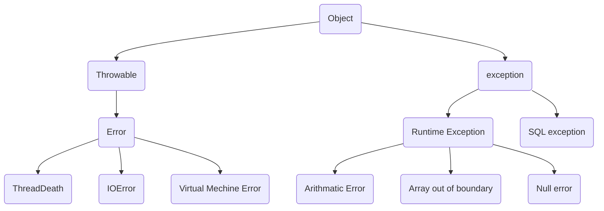

## exceptions hierarchy

```mermaid
graph 
A(Object) --> B(Throwable)
B --> C(Error)
A --> D(exception)
C --> E(ThreadDeath)
C --> F(IOError)
C --> G(Virtual Mechine Error)
D --> I(Runtime Exception)
I --> J(Arithmatic Error)
I --> k(Array out of boundary)
I --> l(Null error)
D --> M(SQL exception)

```